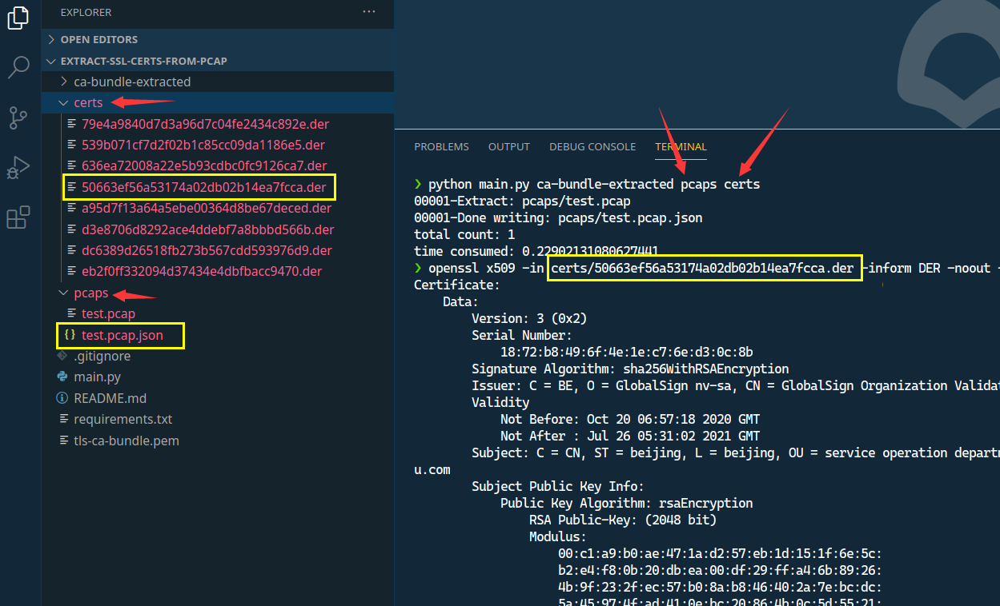

# extract-ssl-certs-from-pcap

提取pcap中的网站证书,输出为`.der`文件,并将提取的相关信息输出为`.json`文件,例如:



* [1. 使用说明](#1-使用说明)
* [2. json输出说明](#2-json输出说明)
* [3. 其他](#3-其他)
  * [3.1. 查看提取的证书](#31-查看提取的证书)
* [4. 参考](#4-参考)

## 1. 使用说明

1. 安装依赖: `pip install -r requirements.txt`
2. 运行主程序, 如: `python main.py ca-bundle-extracted pcaps certs`
   这会将pcaps文件夹下所有pcap包的证书提取到certs文件夹,证书命名为`<证书md5>.der`,ca-bundle-extracted文件夹下存放的是受信任证书(根证书),用它来验证证书链

## 2. json输出说明

```js
{ // (发certificate包的一端就是目的 -- 客户端也可能发certificate包)
    "src_ip": "172.20.113.76", // 源ip
    "dst_ip": "182.61.200.6", // 目的ip
    "src_port": 59686, // 源端口
    "dst_port": 443, // 目的端口
    "server_name": "www.baidu.com", // server_name字段 (从client hello消息中提取出来)
    "cert_chain_len": 2, // 证书链长度
    "is_valid": true, // 验证证书链是否通过
    "cert_chain": [ // 证书链, 最后一个是根证书
        {
            "CN": "baidu.com",
            "ISSUER_CN": "GlobalSign Organization Validation CA - SHA256 - G2",
            "md5": "539b071cf7d2f02b1c85cc09da1186e5"
        },
        {
            "CN": "GlobalSign Organization Validation CA - SHA256 - G2",
            "ISSUER_CN": "GlobalSign Root CA",
            "md5": "d3e8706d8292ace4ddebf7a8bbbd566b"
        }
    ]
}
```

## 3. 其他

### 3.1. 查看提取的证书

```shell
> openssl x509 -in 50663ef56a53174a02db02b14ea7fcca.der -inform DER -noout -text
Certificate:
    Data:
        Version: 3 (0x2)
        Serial Number:
            18:72:b8:49:6f:4e:1e:c7:6e:d3:0c:8b
        Signature Algorithm: sha256WithRSAEncryption
        Issuer: C = BE, O = GlobalSign nv-sa, CN = GlobalSign Organization Validation CA - SHA256 - G2
        Validity
            Not Before: Oct 20 06:57:18 2020 GMT
            Not After : Jul 26 05:31:02 2021 GMT
        Subject: C = CN, ST = beijing, L = beijing, OU = service operation department, O = "Beijing Baidu Netcom Science Technology Co., Ltd", CN = baidu.com
        Subject Public Key Info:
        # ......
```

## 4. 参考

* [github extract_ssl_certs](https://github.com/Master-13/extract_ssl_certs)
* [How can I extract the certificate from this pcap file?](https://security.stackexchange.com/questions/123851/how-can-i-extract-the-certificate-from-this-pcap-file#123859)
* [解析pcap文件并提取其中五元组 c/c++](https://blog.csdn.net/qq_35862309/article/details/88583302)
* [Python Socket模块中的IP转换函数](https://www.jianshu.com/p/e324c2d3a753)
* [SSL 证书格式普及，PEM、CER、JKS、PKCS12](https://blog.freessl.cn/ssl-cert-format-introduce/)
* [python dpkt解析ssl流 极好](https://www.bbsmax.com/A/Gkz18qlZdR/)
* [X.509数字证书的结构与解析](https://blog.csdn.net/xy010902100449/article/details/52145009)
* [Validate x509 Certificate in Python](http://www.yothenberg.com/validate-x509-certificate-in-python/)
* [SSL/TLS协商过程详解](https://blog.csdn.net/zhangtaoym/article/details/55259889)
* [python关于SSL/TLS认证的实现](https://blog.csdn.net/vip97yigang/article/details/84721027)
